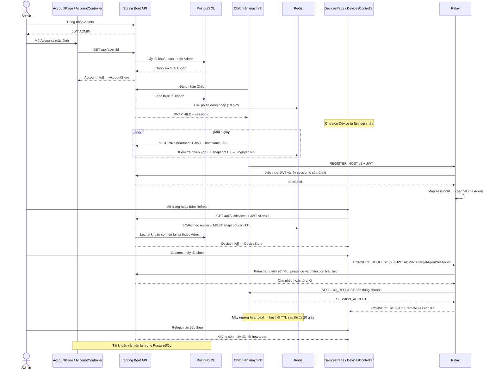
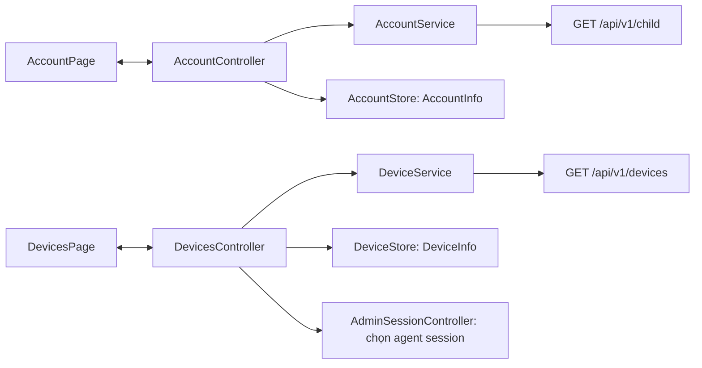

# Account và Device: danh sách tài khoản và các máy đang hoạt động

## Hành vi đã triển khai

- Admin đăng nhập: mở trang Accounts, chỉ fetch `/api/v1/child`.
- Tạo tài khoản: thêm một dòng ở Account; chưa tạo Device.
- Child đăng nhập: server cấp UUID `sessionId` riêng và JWT có claim `sessionId`.
- Heartbeat đầu tiên: tạo snapshot thiết bị trong Redis. Một login chưa heartbeat không xuất hiện ở Devices.
- Mở trang Devices hoặc bấm Refresh: gọi `/api/v1/devices`, thay danh sách bằng snapshot hiện tại.
- Ngừng heartbeat 20 giây: key hết hạn; máy biến mất ở lần refresh kế tiếp. Account vẫn tồn tại.
- Một tài khoản chạy trên hai máy: hai sessionId, hai dòng Devices, một dòng Account.
- Danh sách phản ánh heartbeat gần đây; relay có thể chưa kết nối hoặc đang bận, nên Connect vẫn có thể thất bại.

## Sơ đồ hoạt động



## Ranh giới client



Store chỉ giữ model và phát signal, không gọi HTTP hoặc parse JSON. Service parse DTO tại biên HTTP. AppCoordinator tạo và truyền service/store vào controller. Domain không phụ thuộc Network.

## Dữ liệu và ID

| Giá trị | Ý nghĩa | Thời gian tồn tại |
|---|---|---|
| `Child.id` | Tài khoản con trong PostgreSQL | Đến khi xóa tài khoản |
| Login `sessionId` (UUID) | Một lần đăng nhập Child; khóa để chọn máy | Token và Redis auth session: 10 giờ |
| `presence:v2:<ownerId>:<sessionId>` | JSON chứa childId, username, deviceName, OS, IP, lastHeartbeatAt | TTL 20 giây, gia hạn mỗi heartbeat |
| `auth:child:<sessionId>` | Child ID đã xác thực cho phiên | 10 giờ; xóa khi logout |
| RDTP header `sessionId` (uint64) | Phiên remote streaming do relay cấp | Trong bộ nhớ relay đến khi đóng phiên |

**Login sessionId và RDTP remote sessionId là hai ID khác nhau.** Không dùng username để định tuyến máy nữa. Một máy mở hai instance và login hai lần sẽ có hai dòng; chưa deduplicate theo phần cứng. Không có bảng Device, pairing, lịch sử máy hoặc `last_seen` bền vững.

## API

| Endpoint | Quyền | Dữ liệu |
|---|---|---|
| `POST /api/v1/auth/login` | Public | username/password → token, role, username, userId; Child có thêm sessionId |
| `GET /api/v1/child` | ADMIN | `[{id, username, childUsername}]`, không đọc Redis, không trả password/presence |
| `POST /api/v1/child/register` | ADMIN | Tạo tài khoản; alias `/Register` vẫn được giữ |
| `DELETE /api/v1/child/{username}` | ADMIN chủ sở hữu | Xóa tài khoản; Devices lọc bỏ ngay ở lần refresh kế tiếp |
| `POST /api/v1/child/heartbeat` | CHILD có phiên hợp lệ | `{hostname, os}`; nhận `name` làm alias cũ; deviceUid tùy chọn không dùng làm khóa |
| `POST /api/v1/child/logout` | CHILD | Thu hồi đúng phiên; heartbeat đến muộn bị từ chối |
| `GET /api/v1/devices` | ADMIN | `[{sessionId, childId, username, deviceName, os, ipAddress, lastHeartbeatAt}]` |
| `GET /api/v1/relay/agent` | CHILD | Internal authorization cho relay, trả sessionId dạng text |
| `GET /api/v1/relay/targets/{sessionId}` | ADMIN chủ sở hữu | Internal authorization, chỉ trả ID khi presence/session/tài khoản còn hợp lệ |

REST nghiệp vụ giữ envelope `ApiResponse`. Thời gian heartbeat là Unix milliseconds từ server. Redis lỗi → 503, client giữ cache Devices và báo dữ liệu chưa cập nhật. Refresh không tự chạy định kỳ. Mất toàn bộ Redis auth session cần đăng nhập lại; không chỉ chờ heartbeat.

Relay kiểm tra lại authorization mỗi 10 giây (HTTP timeout 5 giây); khi thu hồi tài khoản/phiên hoặc API không khả dụng, kết nối đang hoạt động bị đóng sau lần kiểm tra kế tiếp. TTL presence không đồng nghĩa với việc socket relay đang sẵn sàng.

## Nâng cấp và chạy

1. Rebuild cả management-api, relay-proxy và Qt client. Không cần migration PostgreSQL.
2. Triển khai đồng bộ: RDTP đã tăng từ **v1 lên v2**. Client/relay v1 bị từ chối vì payload đã đổi sang token và agent session ID.
3. Child phải login lại: JWT cũ không có sessionId không được phép heartbeat hoặc đăng ký relay.
4. Key Redis cũ TTL 15 giây tự hết hạn; code mới chỉ đọc namespace `presence:v2:`.
5. API vẫn lưu/xác thực password theo cơ chế cũ của dự án; thay đổi này chỉ bỏ password khỏi response và UI, không tự migrate password hash.

Biến môi trường:

- Qt `REMOTE_API_URL`: API URL; nếu không đặt giữ URL ngrok đang có trong dự án.
- Qt `REMOTE_RELAY_HOST` / `REMOTE_RELAY_PORT`: mặc định localhost / 8080.
- Relay `MANAGEMENT_API_URL`: mặc định http://localhost:9090; phải trỏ tới cùng management API mà Qt dùng.
- Relay `RELAY_PORT`: mặc định 8080.

Giao thức TCP hiện có chưa thêm TLS trong thay đổi này. Payload v2 mang bearer token, nên chỉ dùng trong môi trường phát triển tin cậy hoặc qua kênh được mã hóa; chưa coi đây là cấu hình triển khai Internet an toàn.

## Kiểm thử

```sh
mvn -f server/pom.xml test
cmake -S clients -B /tmp/remote-access-build
cmake --build /tmp/remote-access-build -j4
QT_QPA_PLATFORM=offscreen ctest --test-dir /tmp/remote-access-build --output-on-failure
```

Kiểm thử TTL với Redis riêng, không dùng Redis chứa dữ liệu thật:

```sh
docker run --rm -d --name remote-access-presence-test -p 127.0.0.1:16379:6379 redis:7-alpine
mvn -f server/management-api/pom.xml -Dtest=PresenceRedisIT test
docker stop remote-access-presence-test
```

`server/tests/account_device_flow.py` chạy với API/relay riêng ở cổng 19090/18080, DB và Redis riêng. Kịch bản tạo tài khoản thử, login hai phiên cùng Child, heartbeat, kiểm tra owner isolation, kết nối chính xác PC, logout và xóa Child. Không chạy trên dữ liệu sản xuất. `TEST_API_URL` và `TEST_RELAY_PORT` cho phép đổi địa chỉ.
